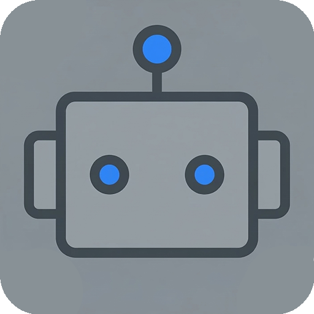
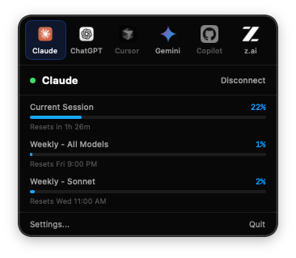

# AgentBar

  

A native macOS menu bar app that tracks your AI coding assistant usage and rate limits at a glance. Supports **Claude**, **ChatGPT**, **Cursor**, **Gemini**, and **GitHub Copilot**.

  

## Features

- **Multi-Provider** — Track Claude, ChatGPT, Cursor, Gemini, and GitHub Copilot from a single menu bar app.
- **Tab Bar Navigation** — Switch between providers with a single click. Original brand icons for each service.
- **Real-Time Usage** — Session and weekly rate limits with progress bars, percentages, and reset countdowns.
- **Cost Tracking** — Scans local Claude Code session files to compute daily and monthly token costs with per-model breakdown.
- **Preferences** — Configurable refresh intervals, provider management, and about info in a dedicated Settings window.
- **Auto-Update** — Built-in Sparkle framework for seamless in-app updates.
- **Keyboard Shortcut** — Toggle the menu with `Ctrl+Option+M` globally.
- **Menu Bar Animations** — Icon pulses during refresh, shows colored indicators for high usage or errors.
- **Local-First** — All data stays on your device. No servers, no telemetry.

## Supported Providers

| Provider | Auth Method | Data |
|---|---|---|
| **Claude** | Claude Desktop cookies or web sign-in | Session, weekly, per-model limits, extra usage credits |
| **ChatGPT** | Web sign-in (Google, Apple, etc.) | Session and weekly usage with reset timers |
| **Cursor** | Web sign-in (browser cookies) | Plan usage, on-demand costs, billing cycle |
| **Gemini** | Gemini CLI credentials (`~/.gemini/oauth_creds.json`) | Per-model quota (Pro, Flash, Flash Lite) |
| **Copilot** | GitHub OAuth Device Flow | Premium interactions and chat quotas |

## Install

Download the latest DMG from [Releases](https://github.com/tansuasici/AgentBar/releases), open it, and drag AgentBar to Applications.

Requires macOS 14.0 (Sonoma) or later.

## How It Works

### Claude
1. If Claude Desktop is installed, usage data is fetched automatically (no sign-in needed)
2. Otherwise, sign in once with your Claude account via the built-in browser
3. Displays session usage, weekly limits per model, and extra credits
4. Cost tracking scans `~/.claude/projects/` for token usage

### ChatGPT
1. Sign in to your ChatGPT account via the built-in browser
2. Usage data is fetched from ChatGPT's internal API via a hidden WebView
3. Displays current session and weekly usage with reset timers

### Cursor
1. Sign in to your Cursor account via the built-in browser
2. Fetches plan usage, on-demand spending, and billing cycle info

### Gemini
1. Install and authenticate [Gemini CLI](https://github.com/google-gemini/gemini-cli) (`gemini login`)
2. AgentBar reads the local OAuth credentials automatically
3. Displays per-model quota usage (Pro, Flash, Flash Lite)

### GitHub Copilot
1. Click "Sign in" to start the GitHub Device Flow
2. Enter the code shown in your browser and authorize
3. Displays premium interaction and chat quotas

## Privacy

All data stays on your device. AgentBar:
- Does **not** send data to any server (only connects to each provider's own API for your usage data)
- Does **not** collect analytics or telemetry
- Cookies are stored locally in isolated per-service data stores
- Cost tracking reads only local files on your machine

## About

Built by [Tansu Asici](https://github.com/tansuasici). Inspired by [CodexBar](https://github.com/steipete/CodexBar).

## License

MIT
